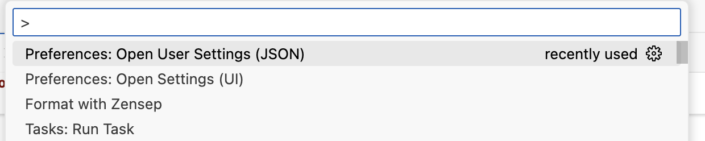

# Zensep VSCode Extension

The zensep formatter comes with a VSCode extension.

The VSCode extension project is in the subfolder vs_code_extension of the zensep git repo.

## VSCode configuration for zensep application and behaviour

VSCode applies a layered 'settings' framework.

### What Are "User" and "Workspace" Settings in VSCode?

VSCode has a layered configuration system. It lets users and teams manage preferences and tool behavior at different levels of granularity.

There are three main scopes for settings:

| Scope         | Applies To                                     | Stored In                       |
| ------------- | ---------------------------------------------- | ------------------------------- |
| **User**      | All projects on your machine (global)          | See Cmd+Shift+P 'Open user settings (JSON)'|
| **Workspace** | A specific folder or project                   | `.vscode/settings.json` inside your project folder                                                 |
| **Folder**    | Specific folders inside a multi-root workspace | A `.code-workspace` file in folder(s)                                    |



The layered configuration applies the 'highest priority' setting in the following order.

* Folder Settings overrides Workspace Settings
* Workspace Settings overrides User Settings
* User Settings overrides Default Settings

### Formatter-Agnostic VSCode 'Settings'

VSCode defines a settings framework that defines how it applies a formatter to code in the editor.

| Setting               | Purpose                                    |
|-----------------------|--------------------------------------------|
| editor.defaultFormatter	| Which formatter to use for a language |
| editor.formatOnSave	| When to format (on save) |
| editor.formatOnPaste	| Format when pasting text |
| editor.formatOnType	| Format as you type (e.g., after ; or {) |
| editor.tabSize	| Number of spaces per tab (passed to formatter)  |
| editor.insertSpaces	| Use spaces instead of tabs  |

It seems VSCode also applies language > default for formatter 'settings'?

Here are two settings in a user settings json file (open with Cmd+Shift+P 'Open user settings (JSON)')

```json
    "[cpp]": {
        "editor.defaultFormatter": "xaver.clang-format"
    },
```

```json
    "editor.defaultFormatter": "itfied.zensep"
```


### Zensep VSCode extension settings

The package.json in the extension project folder contains the 'contributes' section that defines the 'API' to VSCode.

```json
  "contributes": {
    "commands": [
      {
        "command": "zensep.format",
        "title": "Format with Zensep"
      }
    ],
    "languages": [
      {
        "id": "cpp",
        "extensions": [
          ".cpp",
          ".cc",
          ".cxx",
          ".c++",
          ".cp",
          ".hpp",
          ".hh",
          ".hxx",
          ".h++",
          ".hp",
          ".h"
        ]
      }
    ],
    "configuration": {
      "title": "Zensep",
      "properties": {
        "zensep.executablePath": {
          "type": "string",
          "default": "zensep",
          "description": "Path to the zensep executable"
        },
        "zensep.formatOnSave": {
          "type": "boolean",
          "default": false,
          "description": "Format files on save"
        }
      }
    }

```

### Zensep Extension exposed VSCode 'settings'

Zensep exposes a set of zensep-specific settings to be provided from VSCode layered configuration system (Folder>Workspace>User>Default).

They are defined in the extension package.json in extension project folder in 'configuration' section of 'contributes' section.

```json
    "configuration": {
      "title": "Zensep",
      "properties": {
        "zensep.executablePath": {
          "type": "string",
          "default": "zensep",
          "description": "Path to the zensep executable"
        },
        "zensep.formatOnSave": {
          "type": "boolean",
          "default": false,
          "description": "Format files on save"
        }
      }
    }
```

### Zensep Extension exposed 'commands' (Cmd+Shift+P available)

The zensep extension lists the exposed command in the package.json 'contributes' section.

```json
"commands": [
      {
        "command": "zensep.format",
        "title": "Format with Zensep"
      }
    ],
```

And the extension source code implements this command as 'vscode.commands.registerCommand(<command-id>,lambda)'

```javascript
const disposable = vscode.commands.registerCommand('zensep.format', () => { ...

```

### The zensep.code-workspace (experimental)

The zensep repo currently comes with a zensep.code-workspace file generated by AI CLI Claude.

But at the time of this writing it is still unclear if and how to have VSCode apply it for settings in the zensep VSCode project?

It seems to use it you have to ask VSCode to use it with 'code zensep.code-workspace'?

It seems if you do so, then this workspace settings file will override any workspace settings in ```sh./.vscode/settings.json```? 

It is also unclear if the settings in this file is appropriate to ease zensep development?

Still - it is created with the aim to try and provide a good starting ground of zensep settings to use while developing zensep in VSCode.

```json
{
    "folders": [
        {
            "name": "Zensep C++ Formatter",
            "path": "."
        },
        {
            "name": "Zensep VSCode Extension",
            "path": "./vs_code_extension"
        }
    ],
    "settings": {
        "files.exclude": {
            "**/node_modules": true,
            "**/out": true,
            "build/**": true,
            "cmake-build-*/**": true
        },
        // "zensep.executablePath": "${workspaceFolder}/build/Debug/zensep"
    },
    "launch": {
        "configurations": [
            {
                "name": "Build and Run Zensep",
                "type": "cppdbg",
                "request": "launch",
                "program": "${workspaceFolder:Zensep C++ Formatter}/build/Debug/zensep",
                "args": ["--help"],
                "stopAtEntry": false,
                "cwd": "${workspaceFolder:Zensep C++ Formatter}",
                "environment": [],
                "externalConsole": false,
                "MIMode": "lldb",
                "preLaunchTask": "zensep: build"
            },
            {
                "name": "Launch VSCode Extension",
                "type": "extensionHost",
                "request": "launch",
                "runtimeExecutable": "${execPath}",
                "args": [
                    "--extensionDevelopmentPath=${workspaceFolder:Zensep VSCode Extension}",
                    "--user-data-dir=${workspaceFolder:Zensep VSCode Extension}/.vscode-test-user-data"
                ],
                "outFiles": [
                    "${workspaceFolder:Zensep VSCode Extension}/out/**/*.js"
                ],
                "preLaunchTask": "zensep_vscode_extension: build",
                "env": {
                    "ZENSEP_EXECUTABLE_PATH": "${workspaceFolder:Zensep C++ Formatter}/build/Debug/zensep"
                }
            }
        ]
    },
    "tasks": {
        "tasks": [
            {
                "label": "zensep_vscode_extension: build",
                "type": "shell",
                "command": "npm",
                "args": ["run", "compile"],
                "group": "build",
                "presentation": {
                    "echo": true,
                    "reveal": "silent",
                    "focus": false,
                    "panel": "shared"
                },
                "options": {
                    "cwd": "${workspaceFolder:Zensep VSCode Extension}"
                },
                "problemMatcher": ["$tsc"]
            },
            {
                "label": "zensep: configure",
                "type": "shell",
                "command": "cmake",
                "args": ["--preset", "conan-debug"],
                "group": "build",
                "presentation": {
                    "echo": true,
                    "reveal": "always",
                    "focus": false,
                    "panel": "shared"
                },
                "options": {
                    "cwd": "${workspaceFolder:Zensep C++ Formatter}"
                },
                "problemMatcher": []
            },
            {
                "label": "zensep: build",
                "type": "shell",
                "command": "cmake",
                "args": ["--build", "--preset", "conan-debug"],
                "group": "build",
                "presentation": {
                    "echo": true,
                    "reveal": "always",
                    "focus": false,
                    "panel": "shared"
                },
                "options": {
                    "cwd": "${workspaceFolder:Zensep C++ Formatter}"
                },
                "problemMatcher": ["$gcc"],
                "dependsOn": "zensep: configure"
            },
            {
                "label": "zensep: test",
                "type": "shell",
                "command": "${workspaceFolder:Zensep C++ Formatter}/build/Debug/zensep",
                "args": ["--test"],
                "group": "test",
                "presentation": {
                    "echo": true,
                    "reveal": "always",
                    "focus": false,
                    "panel": "shared"
                },
                "options": {
                    "cwd": "${workspaceFolder:Zensep C++ Formatter}"
                },
                "dependsOn": "zensep: build"
            },
            {
                "label": "zensep_vscode_extension: package",
                "type": "shell",
                "command": "npx",
                "args": ["vsce", "package"],
                "group": "build",
                "presentation": {
                    "echo": true,
                    "reveal": "always",
                    "focus": false,
                    "panel": "shared"
                },
                "options": {
                    "cwd": "${workspaceFolder:Zensep VSCode Extension}"
                },
                "dependsOn": "zensep_vscode_extension: build"
            },
            {
                "label": "zensep_vscode_extension: package_and_deploy",
                "type": "shell",
                "command": "sh",
                "args": ["-c", "npx vsce package --out zensep-latest.vsix && echo '\n📦 Package created: zensep-latest.vsix\n🔧 To install: Extensions → ... → Install from VSIX → select zensep-latest.vsix'"],
                "group": "build",
                "presentation": {
                    "echo": true,
                    "reveal": "always",
                    "focus": false,
                    "panel": "shared"
                },
                "options": {
                    "cwd": "${workspaceFolder:Zensep VSCode Extension}"
                },
                "dependsOn": "zensep_vscode_extension: build"
            }
        ]
    },
    "extensions": {
        "recommendations": [
            "ms-vscode.cpptools",
            "ms-vscode.cmake-tools"
        ]
    }
}
```